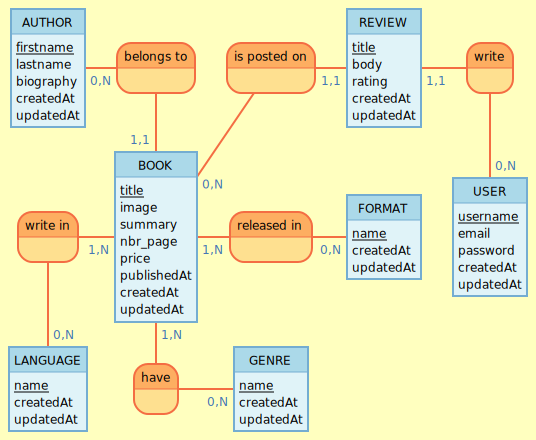

# Projet O'Library

## Description

Ce projet a pour but d'expérimenter Symfony 5, ce site présente et référence des ouvrages de toutes sortes !
Avec une partie back, pour le plaisir de coder une partie maintenance et de mettre aussi les mains dans
la sécurité ! Allez go c'est partis, ce n'est que le début ^^ !

## User stories

⬇️ [User Stories](docs/user_stories.md)

⬇️ [Projets](docs/projet_site_o_library.md)

## Mocodo

